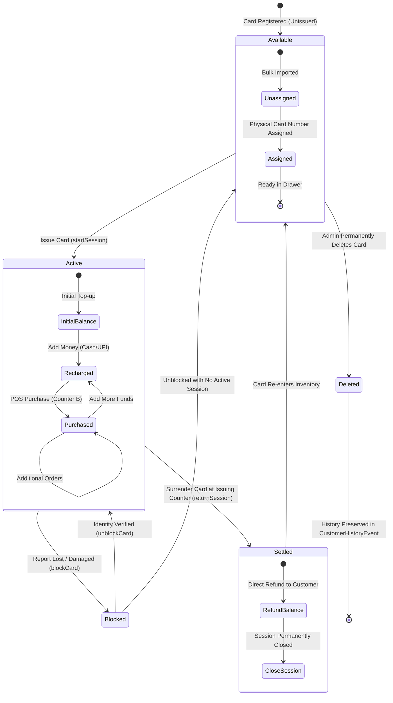
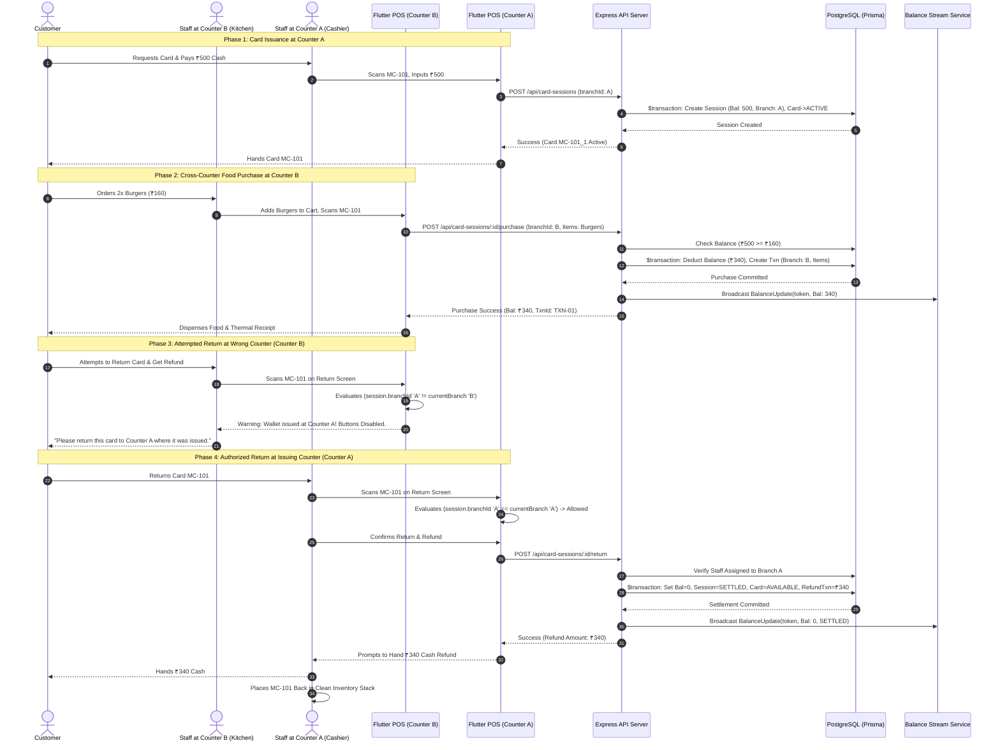

# Money Card Platform — Enterprise Business Logic & Domain Architecture Blueprint

Document Version: 1.0.0  
Classification: Enterprise Domain Specification & Business Architecture  
Sub-Systems Audited:
- Backend Engine: Node.js, Express, TypeScript, Prisma ORM, PostgreSQL
- Web Administration Console: React 18, Vite, TypeScript, Vanilla CSS
- Mobile POS Client: Flutter, Dart, Riverpod, GoRouter, Mobile Scanner, Printing

---

## 1. Executive Summary & Domain Definition

### Core Value Proposition
Money Card is a multi-tenant, closed-loop financial transaction and operational management platform engineered specifically for cafeteria chains, multi-counter food courts, corporate dining facilities, and educational campus dining halls. 

The platform addresses four critical business problems:
1. Queue Bottlenecks & High Latency at Checkout: Eliminates slow cash handling, loose change shortages, and failed online payment gateway timeouts at peak lunch and dinner hours by using instant tap/scan closed-loop prepaid smart cards.
2. Revenue Leakage & Cash Theft: Completely removes open cash drawers at individual food dispensing counters. Recharges occur through dedicated cashier counters or authorized mobile terminals with double-entry cryptographic transaction records.
3. Multi-Counter Operational Coordination: Supports organizations operating multiple distinct kitchen stations or counters (e.g., North Indian, South Indian, Beverages, Desserts). Customers can top-up at any counter, purchase food across any counter in the organization, while physical card return and security deposit settlement remain strictly guarded at the issuing counter for physical inventory control.
4. Real-Time Inventory & Financial Transparency: Eliminates manual end-of-day register reconciliation by providing live streaming balances via Server-Sent Events (SSE), real-time stock deductions, itemized purchase histories, and PDF export pipelines across web and mobile.

### Domain Model Classification
The platform operates at the intersection of:
- Closed-Loop FinTech: Stored-value card lifecycle management, balance state machines, immutable transaction ledgers, cash drawer reconciliation, and recharge cancellations.
- Point-of-Sale (POS) & Restaurant Operations: Menu catalogs, category management, kitchen counter routing, real-time stock levels, and thermal receipt generation.
- B2B Multi-Tenant SaaS: Multi-organization tenancy, role-based access control (RBAC), subscription billing tiers, custom limit overrides, and tenant-scoped data isolation.

### Core Business Entities & Conceptual Relationships

```
+-----------------------------------------------------------------------------------+
|                                   Organization                                    |
| (Tenant root: cafeteria business entity, billing subscription, and brand identity)|
+-----------------------------------------+-----------------------------------------+
                                          |
        +---------------------------------+---------------------------------+
        | 1:N                             | 1:N                             | 1:N
        v                                 v                                 v
+---------------+                 +---------------+                 +---------------+
|    Branch     |                 |     User      |                 |     Plan      |
|   (Counter)   |                 | (Admin/Staff) |                 | (SaaS Tier)   |
+-------+-------+                 +-------+-------+                 +-------+-------+
        |                                 |                                 |
        | 1:N (Assignments)               | 1:N (Permissions)               | 1:1
        +-----------------+---------------+                                 v
                          |                                         +---------------+
                          v                                         | Subscription  |
                  +---------------+                                 |  (Overrides)  |
                  |  UserBranch   |                                 +---------------+
                  +---------------+
                          |
        +-----------------+-----------------+
        | 1:N (Issuance)                    | 1:N (Catalog)
        v                                   v
+---------------+                   +---------------+
|     Card      |                   |    Product    |
| (Physical QR) |                   |  (Menu Item)  |
+-------+-------+                   +-------+-------+
        |                                   |
        | 1:N (Re-issuance Cycles)          | 1:N (Inventory)
        v                                   v
+---------------+                   +---------------+
|  CardSession  |                   |BranchInventory|
| (Active Wallet|<-------+          | (Stock Count) |
+-------+-------+        |          +---------------+
        |                |
        | 1:N            |
        v                |
+---------------+        |
|  Transaction  |--------+
|   (Ledger)    | (Deductions, Recharges, Refunds)
+---------------+
```

The primary domain nouns include:
- Organization: The supreme tenant boundary. All branches, users, cards, products, and subscriptions belong strictly to one organization.
- Plan & Subscription: The contractual SaaS agreement determining the maximum allowable branches (counters), staff accounts, and registered cards. Supports administrative overrides per tenant.
- Branch (Counter): A physical operational workstation (e.g., Main Cashier Counter, Coffee Station, Hot Meals Counter). Staff are assigned to branches, and active wallets belong to an issuing branch.
- User: An authenticated persona spanning four operational tiers: Super Admin (platform owner), Organization Admin (cafeteria business owner), Counter Admin (counter manager with counter dashboard and team management), and Counter Staff (cashier/operator executing billing and recharges).
- Card: A physical asset identified by a permanent printed card number (e.g., `MC-101`) and an opaque cryptographic QR token (`qtk_...`). A card is reusable across countless customer sessions.
- CardSession: A finite, closed-loop wallet lifetime. Initiated when a card is issued to a customer, tracks live mutable balance, and terminates permanently when settled/returned. Suffixes the card number with a cycle counter (e.g., `MC-101_1`, `MC-101_2`) for uncompromised accounting separation.
- Transaction: An append-only, immutable financial and operational ledger entry recording the exact timestamp, staff user, branch, amount, balance before, balance after, transaction type, and itemized food payload.
- Product & BranchInventory: Menu items categorized by food type, associated with prices and stock tracking per branch.
- CustomerHistoryEvent: A regulatory and compliance audit log capturing state transitions for cards (issued, blocked, unblocked, returned, deleted).

---

## 2. User Roles & Permission Matrix (RBAC & Tenancy)

### Tenancy & Authentication Architecture
- Dual-Token Authentication: Employs short-lived JWT access tokens (15-minute validity) alongside secure HTTP-only refresh tokens (7-day validity).
- Token Version Invalidation: Each user record contains a `tokenVersion` integer. Whenever an administrator changes credentials, disables an account, or resets permissions, the token version increments, immediately rendering all outstanding access tokens invalid across all devices.
- Multi-Tenancy Isolation (`tenant.middleware.ts`):
  - Super Admin: Operates with global tenancy (`organizationId: null`). Can inspect, configure, and override all organizations.
  - Org Admin & Staff: Strict tenant locking. Every database query in Express controllers enforces `where: { organizationId: req.user.organizationId }`. Requests supplying an explicit `organizationId` matching a foreign tenant are rejected with HTTP 403 `ORGANIZATION_ACCESS_DENIED`.
  - Branch Scoping: Staff operations are validated against `req.user.assignedBranchIds`. For branch-level write actions, staff cannot operate outside their designated counter without explicit permission or cross-counter policy approval.

### Role & Permission Matrix

The platform models four distinct user personas across its administrative and operational tiers:

| Role / Persona | Database Role & Scope | Operational Scope | Permitted Business Actions | Critical Restrictions / Guardrails |
|---|---|---|---|---|
| **Super Admin** | `Role.SUPER_ADMIN` (`organizationId: null`) | Global Platform (All Organizations) | - Create, suspend, and activate Organizations<br>- Manage subscription plans, pricing, and billing intervals<br>- Grant custom limit overrides (counters, staff, cards)<br>- Audit platform-wide health and SaaS revenue KPIs | - Strictly prohibited from executing POS retail sales or initiating card recharges without tenant context<br>- Cannot bypass audit logging |
| **Organization Admin** | `Role.ORG_ADMIN` (linked to `Organization`) | Entire Single Organization | - Configure organization profile, logo, and contact info<br>- Create and manage counters/branches up to plan limit<br>- Create and manage staff accounts and grant M0 permissions<br>- Register and bulk import physical cards up to card limit<br>- View complete organizational financial & menu analytics<br>- Request plan upgrades, downgrades, and renewals<br>- Block, unblock, and permanently delete cards | - Cannot access data belonging to other organizations<br>- Cannot exceed plan limits without super admin override<br>- Cannot delete cards with active open sessions<br>- Cannot delete branches with historical financial transactions |
| **Counter Admin** (Counter Manager) | `Role.STAFF` (with `UserBranch` & `STAFF_MANAGE` / `BRANCH_VIEW`) | Assigned Counter(s) in Organization | - Dedicated **Counter Dashboard** (`isCounterAdmin` mode) scoped strictly to their counter<br>- Provision credentials and manage team members assigned to their counter<br>- Issue available cards, recharge balance, and execute POS purchases<br>- Settle active sessions and refund balances for cards issued at their counter<br>- Inspect counter-specific revenue KPIs, sales summaries, and shift cash drawers<br>- Manage local counter inventory and adjust stock thresholds | - Cannot access or modify other counters' staff, inventory, or operational settings<br>- Cannot return or refund cards issued by another counter (`RETURN_COUNTER_MISMATCH`)<br>- Cannot access organizational subscription billing or plan change requests<br>- Cannot create new counters/branches |
| **Counter Staff** (POS Operator / Cashier) | `Role.STAFF` (operational M0 permissions without `STAFF_MANAGE`) | Assigned Counter POS Terminal / Mobile Client | - Operate Flutter Mobile POS and web billing screens<br>- Scan card QR codes, check live balances, and view menu items<br>- Top-up card balances via Cash or UPI (`RECHARGE`)<br>- Add products to cart and deduct card balances (`PURCHASE`)<br>- Settle active sessions and refund cards issued at their counter (`CARD_RETURN`)<br>- Print thermal billing and recharge receipts | - Strictly prohibited from creating or modifying staff accounts (`STAFF_MANAGE` withheld)<br>- Cannot modify branch details or counter credentials (`BRANCH_MANAGE` withheld)<br>- Cannot view organizational analytics or platform settings<br>- Cannot return or refund cards issued at other counters (`RETURN_COUNTER_MISMATCH`) |

### Granular M0 Permission Catalog (18 Distinct Codes)

1. Cards Domain:
   - `CARD_VIEW`: Read card list, active session details, and status.
   - `CARD_ISSUE`: Activate an available card and issue it to a customer with initial balance.
   - `CARD_RETURN`: Settle an active session, refund remaining balance, and return card to inventory.
   - `CARD_BLOCK`: Suspend a card immediately due to loss or damage.
   - `CARD_UNBLOCK`: Reactivate a blocked card after customer identity verification.
2. Sessions & Financial Domain:
   - `RECHARGE`: Add money to an active card wallet using Cash or UPI.
   - `PURCHASE`: Add food items to cart and deduct card balance at the POS.
   - `REFUND`: Execute direct balance refunds without closing the card session.
   - `SESSION_VIEW`: Inspect customer transaction timelines and audit trails.
3. Products & Inventory Domain:
   - `PRODUCT_VIEW`: Browse menu items, categories, and retail prices.
   - `PRODUCT_MANAGE`: Create, modify, and archive menu items.
   - `INVENTORY_VIEW`: View stock on hand and low-stock warning indicators.
   - `INVENTORY_MANAGE`: Manually adjust stock quantities and thresholds.
   - `INVENTORY_IMPORT`: Bulk import catalog items from CSV/JSON.
4. Analytics & Reports Domain:
   - `VIEW_ANALYTICS`: Access financial breakdown, sales volume, and dish demand metrics.
   - `VIEW_REPORTS`: Download itemized audit PDF reports.
5. Staff & Branch Domain:
   - `STAFF_VIEW`: View fellow staff members assigned to the counter.
   - `STAFF_MANAGE`: Provision credentials and modify permissions for counter staff.
   - `BRANCH_VIEW`: Read branch location details.
   - `BRANCH_MANAGE`: Update branch operational settings.

---

## 3. Data Entities & Business Lifecycle States

Database Architecture: PostgreSQL orchestrated via Prisma ORM. Utilizes strict relational foreign keys, cascade deletes where appropriate, `ON DELETE SET NULL` for historical audit preservation, and composite uniqueness constraints.

### 1. Card Entity
- Table: `cards`
- Schema Invariants:
  - `organizationId + physicalCardNumber` is strictly unique. No two cards in the same organization can share a card number.
  - `qrToken` is globally unique across the entire database platform.
  - Permanent audit safety: Customer history events reference `cardId` with `ON DELETE SET NULL` so card deletions never delete historical event trails.
- State Machine:
  - `AVAILABLE`: Unissued physical card sitting in counter drawer. Ready for customer assignment.
  - `ACTIVE`: Issued to a customer with an active `CardSession`. Mutable balance attached. Cannot be issued again.
  - `BLOCKED`: Suspended due to loss or security flag. All recharges, purchases, and settlements are strictly blocked.
- Transition Rules:
  - `AVAILABLE` -> `ACTIVE`: Triggered exclusively by `startSession` or `createSession`.
  - `ACTIVE` -> `AVAILABLE`: Triggered exclusively by `returnSession` when balance is zeroed and session is `SETTLED`.
  - `ACTIVE` -> `BLOCKED`: Triggered by `blockCard`. Active session remains preserved in background.
  - `BLOCKED` -> `ACTIVE`: Triggered by `unblockCard` if an active session exists on the card.
  - `BLOCKED` -> `AVAILABLE`: Triggered by `unblockCard` if no active session exists on the card.
  - Disallowed: Cannot transition `AVAILABLE` -> `BLOCKED` directly without administrative override. Cannot delete any card while in `ACTIVE` state.

### 2. CardSession Entity
- Table: `card_sessions`
- Schema Invariants:
  - `sessionToken` is globally unique.
  - `balance >= 0.0`. Floating point balance cannot drop below zero under any purchase circumstance.
  - `cycleNumber` strictly increments on each re-issuance of the same physical card.
- State Machine:
  - `ACTIVE`: Customer is carrying the wallet. Can recharge at any counter, purchase at any counter.
  - `SETTLED`: Wallet has been surrendered at issuing counter. Balance is refunded to 0.0. Session is permanently frozen.
- Transition Rules:
  - `ACTIVE` -> `SETTLED`: Triggered only by `returnSession` at the counter where `session.branchId` matches staff counter.
  - Disallowed: `SETTLED` sessions can never be reopened, recharged, or debited.

### 3. Organization Entity
- Table: `organizations`
- State Machine:
  - `PENDING_ACTIVATION`: Created but awaiting initial admin email verification or password setup.
  - `ACTIVE`: Normal business operations.
  - `SUSPENDED`: Temporarily locked by Super Admin due to non-payment or breach. All staff logins and API calls return HTTP 403 `ORGANIZATION_INACTIVE`.
  - `INACTIVE`: Decommissioned organization.

### 4. Subscription & Plan Entity
- Tables: `plans`, `subscriptions`, `plan_change_requests`
- State Machine (`SubscriptionStatus`):
  - `TRIAL` -> `ACTIVE` -> `EXPIRED` -> `SUSPENDED` / `CANCELLED`
- Effective Limits Logic (`limits.ts`):
  - Every tenant limit (`branchLimit`, `staffLimit`, `cardLimit`) evaluates hierarchical priority:
    `Effective_Limit = Subscription_Override ?? Plan_Default`
  - Prevents hard locks while providing flexible enterprise customizations.

### 5. Transaction Entity (Ledger)
- Table: `transactions`
- Invariant: Completely append-only. No `UPDATE` or `DELETE` operations exist on financial columns.
- Structure:
  - `type`: `RECHARGE_CASH` | `RECHARGE_UPI` | `PURCHASE` | `REFUND_RETURN`
  - `amount`: Always positive floating value.
  - `balanceBefore` and `balanceAfter`: Explicit proof of mathematical integrity.
  - `items`: Structured JSON storing itemized food lines: `[{ productId, itemName, unitPrice, quantity, subtotal }]`.
  - For recharge cancellations, the record is flagged in JSON metadata (`isCancelled: true, cancelledAt, cancelledByUserId`) while an offsetting balance adjustment is applied to the session.

---

## 4. End-to-End Business Workflows

### Workflow 1: Physical Card Issuance & Wallet Activation
- Preconditions:
  - Physical card exists in database with status `AVAILABLE` (or is auto-registered from physical stock).
  - Staff possesses `CARD_ISSUE` permission.
  - Active staff branch is selected.
  - Customer optional details: Name, Phone (10 digits).
- Client Execution (Flutter Mobile POS):
  1. Staff scans QR code or manually inputs card number (e.g., `MC-101`).
  2. Client validates input format and checks active session status.
  3. Staff enters initial top-up amount (e.g., 500) and selects payment mode (`CASH` or `UPI`).
  4. Client dispatches `POST /api/card-sessions` with payload: `{ cardId, branchId, initialAmount, paymentMethod, customerName, customerPhone }`.
- Backend Orchestration (Express):
  1. `requireAuth` validates staff JWT and active status.
  2. `requirePermission(PermissionCode.CARD_ISSUE)` confirms staff privilege.
  3. Verifies branch is `ACTIVE` and assigned to staff.
  4. Verifies card is not `BLOCKED` and not `ACTIVE`.
  5. Executes atomic Prisma transaction:
     - Calculates `cycleNumber = count(sessions for card) + 1`.
     - Sets `sessionCardNumber = "${card.physicalCardNumber}_${cycleNumber}"`.
     - Creates `CardSession` with `balance: initialAmount`.
     - Updates `Card` status to `ACTIVE`.
     - If `initialAmount > 0`, creates `Transaction` record (`RECHARGE_CASH` or `RECHARGE_UPI`).
     - Creates `CustomerHistoryEvent` (`action: CARD_ISSUED`).
- Database Settlement (PostgreSQL):
  - Commits all records in a single ACID transaction.
- Postconditions & Side Effects:
  - Real-time SSE service broadcasts `INIT` event to balance stream.
  - Flutter POS generates digital receipt and plays confirmation sound.

### Workflow 2: Cross-Counter Food Purchase
- Preconditions:
  - Customer presents active card at Counter B (e.g., Beverage Counter).
  - Card was originally issued at Counter A (e.g., Main Food Counter).
  - Card status is `ACTIVE` and not `BLOCKED`.
  - Card balance is greater than or equal to cart total.
  - Staff at Counter B has `PURCHASE` permission.
- Client Execution (Flutter Mobile POS):
  1. Staff selects food items from catalog (e.g., 2x Fresh Lime Soda @ 40 = 80).
  2. Staff scans card QR code or inputs card number.
  3. Client checks `cartTotal <= session.balance`. If insufficient, displays shortfall modal and halts.
  4. Dispatches `POST /api/card-sessions/:id/purchase` with `{ items: [{ productId, quantity }], branchId: currentBranch.id }`.
- Backend Orchestration (Express):
  1. Verifies authentication and `PURCHASE` permission.
  2. Identifies effective purchasing branch from `branchId` body parameter or `x-branch-id` header.
  3. Verifies purchasing branch is `ACTIVE` and belongs to same organization.
  4. Starts atomic transaction:
     - Verifies each product exists in organization and calculates exact current prices.
     - Verifies session is still `ACTIVE` and balance has not changed concurrently.
     - Enforces `balance >= totalCost`.
     - Deducts balance: `balanceAfter = currentSession.balance - totalCost`.
     - Creates immutable `Transaction` (`type: PURCHASE`, `branchId: effectiveBranchId`, `amount: totalCost`, `items: detailedItemsJson`).
     - If inventory tracking is enabled for branch, decrements `BranchInventory.quantity`.
- Database Settlement (PostgreSQL):
  - ACID commit guarantees that balance cannot be double-spent across multiple simultaneous counters.
- Postconditions & Side Effects:
  - Revenue and transaction volume are credited to Counter B (the purchasing counter).
  - Card session retains reference to Counter A as issuing branch.
  - SSE balance stream broadcasts `PURCHASE` event with new remaining balance.
  - Thermal sales receipt is generated with itemized bill breakdown.

### Workflow 3: Wallet Return & Settlement (Issuing Counter Guard)
- Preconditions:
  - Customer completes dining and presents card to settle deposit and remaining balance.
  - Customer MUST present card at Counter A (where wallet was issued).
  - Staff possesses `CARD_RETURN` permission.
- Client Execution (Flutter Mobile POS):
  1. Staff scans card at Return Screen.
  2. Client checks `session.branchId == currentBranch.id`:
     - If mismatched: Immediately displays amber warning: "This wallet was issued at another counter (Counter A). Returns and refunds must be processed at Counter A." Return and refund buttons are strictly disabled.
  3. If matched: Staff taps "Confirm Return & Refund".
  4. Client dispatches `POST /api/card-sessions/:id/return`.
- Backend Orchestration (Express):
  1. Validates staff authorization and `CARD_RETURN` permission.
  2. Checks:
     `if (req.user.role === 'STAFF' && !req.user.assignedBranchIds.includes(session.branchId))`
     `return sendError(res, 403, 'RETURN_COUNTER_MISMATCH', 'This card must be returned at the counter where it was issued')`.
  3. Executes atomic transaction:
     - Reads remaining balance: `refundAmount = session.balance`.
     - Updates `CardSession`: `balance: 0.0, status: SETTLED, settledAt: now, settledByUserId: staff.id, refundAmount`.
     - If `refundAmount > 0`, creates `Transaction` (`type: REFUND_RETURN, amount: refundAmount, balanceBefore: refundAmount, balanceAfter: 0.0`).
     - Updates physical `Card` status to `AVAILABLE`.
     - Creates `CustomerHistoryEvent` (`action: CARD_RETURNED`).
- Database Settlement (PostgreSQL):
  - Session is permanently closed. Physical card is returned to counter available inventory for the next customer.
- Postconditions:
  - Cashier hands customer exact cash refund.
  - SSE broadcasts `REFUND` event (balance 0.0, status `SETTLED`).
  - Physical card is physically placed back in the clean card stack.

### Workflow 4: Immediate Top-Up Void / Cancellation
- Preconditions:
  - Staff mistakenly typed 5000 instead of 500 during recharge.
  - Card is still `ACTIVE`.
  - Customer has not spent any money from this top-up (`session.balance >= rechargeAmount`).
  - No subsequent recharge transactions have occurred after this transaction on this session.
- Client Execution:
  1. Staff views transaction in session details and taps "Cancel Top-Up".
  2. Enters required cancellation reason.
  3. Dispatches `POST /api/card-sessions/transactions/:id/cancel-recharge`.
- Backend Orchestration:
  1. Validates transaction exists, belongs to tenant, and is a recharge type.
  2. Verifies transaction has not been cancelled previously (`items.isCancelled !== true`).
  3. Verifies this is the latest recharge on the card.
  4. Verifies `session.balance >= txRecord.amount`.
  5. Atomically deducts top-up amount from session balance and annotates transaction metadata with cancellation details.
- Postconditions:
  - Customer card balance is restored to previous amount without corrupting accounting history.

---

## 5. Domain Rules, Calculations, & Algorithmic Policies

### Financial & Numerical Formulas
1. Closed-Loop Ledger Invariant:
   `Balance(T_n) = Balance(T_{n-1}) + Inflow(T_n) - Outflow(T_n)`
   At all times, the balance stored on `card_sessions.balance` must equal the sum of all historical transaction amounts for that `sessionId`.
2. Item Subtotal & Total Bill Formula:
   `Item_Subtotal = Product_Price * Quantity`
   `Bill_Total = Sum(Item_Subtotal_1 .. Item_Subtotal_k)`
3. Net Cash Collected at Counter:
   `Net_Cash = (Recharge_Cash_Volume) - (Refund_Return_Volume) - (Cancelled_Cash_Topups)`
   Represents physical cash that must physically exist in the drawer at shift close.
4. Net Digital Revenue (UPI):
   `Net_UPI = (Recharge_UPI_Volume) - (Cancelled_UPI_Topups)`

### Time-Based Policies & Lifecycles
- Session Duration: Sessions do not expire automatically by time; they remain `ACTIVE` until explicitly returned by staff, allowing multi-hour or full-day campus visits.
- Password Reset Token Expiration: 1 hour (`60 * 60 * 1000 ms`).
- Account Activation Token Expiration: 72 hours (`72 * 60 * 60 * 1000 ms`).
- JWT Access Token Expiration: 15 minutes.
- JWT Refresh Token Expiration: 7 days.

### Strict Validation Constraints
- Phone Number Rules: Exactly 10 digits; Indian mobile standard must start with digits 6, 7, 8, or 9. Normalized across the platform by stripping country codes (`+91`, `91`, leading `0`).
- Card Identification Format: Supports physical labels (e.g., `MC-101`, `CARD-50`) and opaque QR tokens (`qtk_<uuid>`).
- Counter Name Rules: 2 to 20 characters; alphanumeric plus spaces, hyphens, and ampersands (`^[a-zA-Z0-9\s\-&]+$`).
- Effective Limit Quotas:
  - Starter Plan: 1 Counter, 5 Staff, 100 Cards.
  - Standard Plan: 3 Counters, 15 Staff, 500 Cards.
  - Premium Plan: 10 Counters, 50 Staff, 2000 Cards.
  - Enterprise Plan: Unlimited Counters, Unlimited Staff, Unlimited Cards.

### Error Handling & Standardized Response Protocol
All API responses follow a strict discriminated union pattern:

Success Envelope (HTTP 200 / 201):
```json
{
  "success": true,
  "data": { ... },
  "meta": { "total": 100, "page": 1, "limit": 50 }
}
```

Failure Envelope (HTTP 400 / 401 / 403 / 404 / 409 / 500):
```json
{
  "success": false,
  "error": {
    "code": "RETURN_COUNTER_MISMATCH",
    "message": "This card must be returned at the counter where it was issued"
  }
}
```

Key Domain Error Codes:
- `RETURN_COUNTER_MISMATCH`: Staff attempting to return/refund wallet at wrong counter.
- `CARD_BLOCKED`: Operation attempted on a blocked card.
- `INSUFFICIENT_BALANCE`: Purchase total exceeds card balance.
- `CARD_ALREADY_ACTIVE`: Attempting to issue a card that is already in use.
- `ALREADY_SETTLED`: Attempting to perform transactions on a closed session.
- `BRANCH_LIMIT_REACHED`: Tenant attempted to create more branches than plan permits.
- `STAFF_LIMIT_REACHED`: Tenant attempted to add more staff than plan permits.
- `CARD_LIMIT_REACHED`: Tenant attempted to register more cards than plan permits.
- `CANNOT_CANCEL_PREVIOUS_RECHARGE`: Void requested on an outdated recharge.

---

## 6. Client vs. Server Responsibility Audit

| Responsibility Area | Flutter Mobile Client Enforcement | Express / PostgreSQL Server Enforcement | Audit Finding & Assessment |
|---|---|---|---|
| Card Return Counter Matching | Disables Return/Refund buttons and displays warning banner when `session.branchId != currentBranch.id`. | Rejects request with HTTP 403 `RETURN_COUNTER_MISMATCH` if staff is not assigned to `session.branchId`. | Perfect Parity. Client provides immediate UX feedback; server strictly defends data integrity. |
| Insufficient Balance Prevention | Compares `cartTotal > session.balance` and shows informative shortfall dialog. | Enforces `currentSession.balance < totalCost` inside atomic Prisma transaction and rolls back. | Perfect Parity. Prevents accidental server calls; backend guarantees race-condition safety. |
| Blocked Card Handling | Checks `card.status == CardStatus.blocked` upon scan and disables all action buttons. | Controller verifies `card.status !== BLOCKED` in issue, recharge, and purchase endpoints. | Perfect Parity. |
| Counter Name & Phone Formats | Regex validation on text controllers (`^[a-zA-Z0-9\s\-&]+$`, 10 digits). | Zod schemas and controller regex checks enforce identical character lengths and regex rules. | Perfect Parity. |
| Limit Enforcement (Cards, Staff, Branches) | Displays current usage count and warning banner when approaching plan limits. | Authoritative gatekeeper. Executes `count()` within `$transaction` against `effectiveLimits`. | Robust Architecture. Client informs; server strictly guarantees licensing compliance. |
| Cross-Counter Purchase Attribution | Passes `currentBranch.id` in purchase request body. | Validates branch is active and belongs to tenant; sets `Transaction.branchId` to purchasing counter. | Server-authoritative. Revenue accurately flows to the dispensing kitchen counter. |

---

## 7. External Integrations & Automated Triggers

### 1. Zero-Configuration Local Discovery (mDNS / Bonjour Service)
- Technology: `bonjour-service` in Express, `nsd` / `multicast_dns` in Flutter.
- Function: In offline or local development setups, the Express server broadcasts its IP and port over Multicast DNS using the service type `_moneycard-api._tcp`.
- Business Value: Eliminates manual IP address configuration on Android POS terminals connected to local cafeteria Wi-Fi networks.

### 2. Transactional Email Dispatch Pipeline
- Multi-Provider Failover Architecture:
  1. Google Mail Webhook: First priority if configured.
  2. Gmail SMTP: Authenticated TLS transport for direct delivery.
  3. Brevo API: Secondary enterprise transactional email engine.
  4. Resend API: Modern cloud transactional engine.
  5. Console Fallback: Prints formatted activation links in development mode.
- Use Cases:
  - Account Activation: 72-hour secure token link for new staff and organization admins.
  - Password Reset: 1-hour secure reset token link.

### 3. Server-Sent Events (SSE) Real-Time Balance Streaming
- Service: `balanceStreamService.ts`
- Route: `GET /api/public/cards/:token/stream`
- Business Value: Powers public customer portal QR scans. When a customer scans their card QR code on their personal smartphone, the portal screen stays open. As soon as the counter staff recharges the card or POS staff debits a food purchase, the customer's phone balance updates instantly without page refresh.

### 4. Hardware POS & Printing Touchpoints
- Thermal Paper Printing (`printing` package): Generates 58mm/80mm ESC/POS formatted receipts for recharges and sales.
- Camera Scanner (`mobile_scanner`): High-speed QR scanner supporting continuous scanning mode with audio-haptic feedback.
- Shorebird CodePush: Over-the-air (OTA) Flutter engine patch delivery for rapid zero-downtime updates to staff POS hardware.

---

## 8. End-to-End Visual Flowcharts (Mermaid.js)

### Diagram A: Entity-Relationship & State Lifecycle Diagram



### Diagram B: Cross-Counter Purchase & Issuing Return Sequence Flow



---

End of Blueprint.
